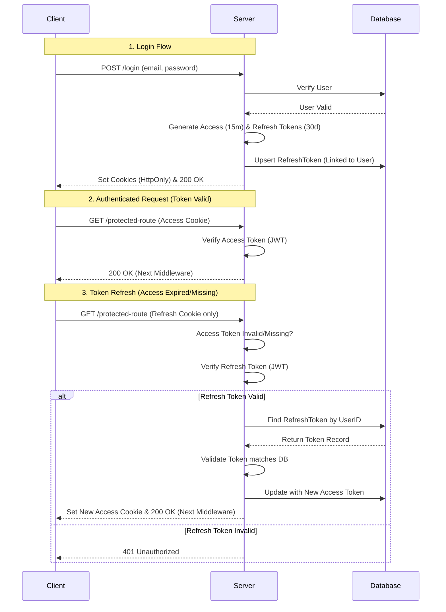

```mermaid
sequenceDiagram
    participant C as Client
    participant S as Server
    participant DB as Database

    Note over C, S: 1. Login Flow
    C->>S: POST /login (email, password)
    S->>DB: Verify User
    DB-->>S: User Valid
    S->>S: Generate Access (15m) & Refresh Tokens (30d)
    S->>DB: Upsert RefreshToken (Linked to User)
    S-->>C: Set Cookies (HttpOnly) & 200 OK

    Note over C, S: 2. Authenticated Request (Token Valid)
    C->>S: GET /protected-route (Access Cookie)
    S->>S: Verify Access Token (JWT)
    S-->>C: 200 OK (Next Middleware)

    Note over C, S: 3. Token Refresh (Access Expired/Missing)
    C->>S: GET /protected-route (Refresh Cookie only)
    S->>S: Access Token Invalid/Missing?
    S->>S: Verify Refresh Token (JWT)
    alt Refresh Token Valid
        S->>DB: Find RefreshToken by UserID
        DB-->>S: Return Token Record
        S->>S: Validate Token matches DB
        S->>DB: Update with New Access Token
        S-->>C: Set New Access Cookie & 200 OK (Next Middleware)
    else Refresh Token Invalid
        S-->>C: 401 Unauthorized
    end
```
